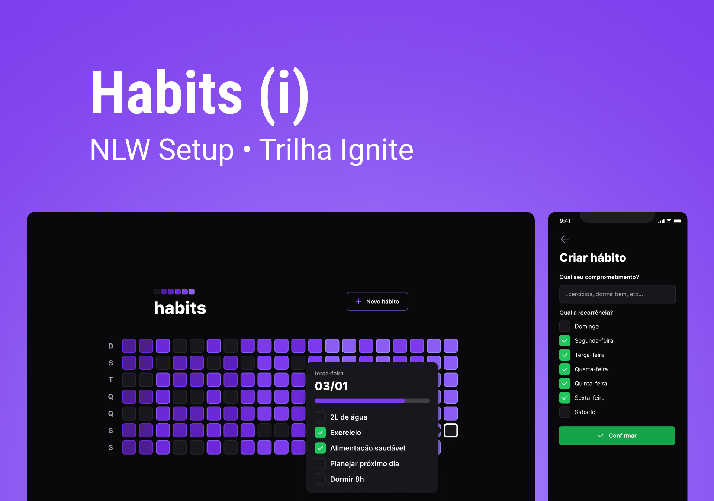

  

O NLW Setup foi um evento exclusivo e gratuito, promovido pela <a href="https://www.rocketseat.com.br/">Rocketseat</a> para ensino de tecnologias WEB.

  <a href="#-tecnologias">Tecnologias</a>&nbsp;&nbsp;&nbsp;|&nbsp;&nbsp;&nbsp;
  <a href="#-projeto">Projeto</a>&nbsp;&nbsp;&nbsp;|&nbsp;&nbsp;&nbsp;
  <a href="#-layout">Layout</a>&nbsp;&nbsp;&nbsp;|&nbsp;&nbsp;&nbsp;
  <a href="#-licença">Licença</a>&nbsp;&nbsp;&nbsp;|&nbsp;&nbsp;&nbsp;
  <a href="#autor">Autor</a>

  

 

  

## 💻 Projeto

O Habits é uma ferramenta para acompanhamento de hábitos onde o usuário pode registrar diariamente as suas resoluções e acompanhar a sua evolução.

## 🚀 Tecnologias

Esse projeto foi desenvolvido com as seguintes tecnologias:

- [Node.js](https://nodejs.org/)
- [Fastify](https://www.fastify.io/)
- [Prisma](https://prisma.io/)
- [Zod](https://zod.dev/)
- [Typescript](https://www.typescriptlang.org/)
- [React](https://reactjs.org/)
- [React Native](https://reactnative.dev/)
- [Tailwindcss](https://tailwindcss.com/)
- [Radix](https://www.radix-ui.com/)
- [Expo](https://expo.dev/)
- [Reanimated](https://docs.swmansion.com/react-native-reanimated/)

## 🔖 Layout

Você pode visualizar o layout do projeto através [DESSE LINK](https://www.figma.com/community/file/1195326661124171197). É necessário ter conta no [Figma](https://figma.com) para acessá-lo.

## 📝 Licença

Esse projeto está sob a licença MIT.

---

## Autor

 

Feito com 💜 por Jordane Chaves